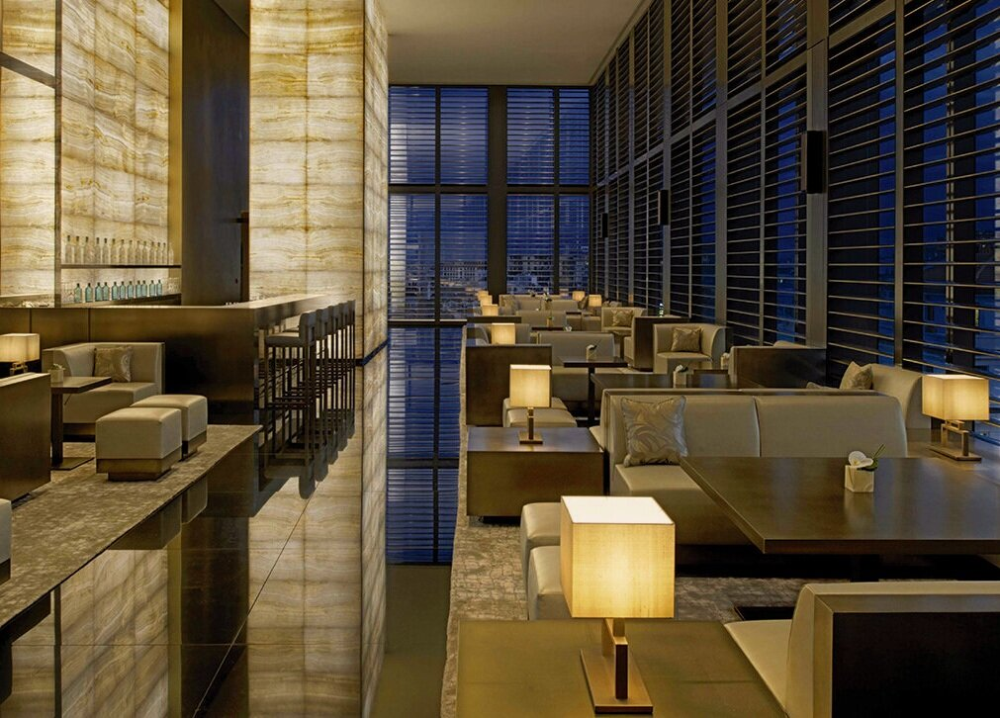
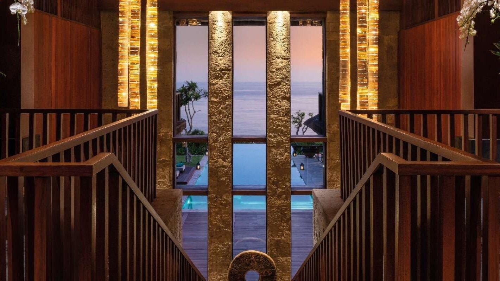
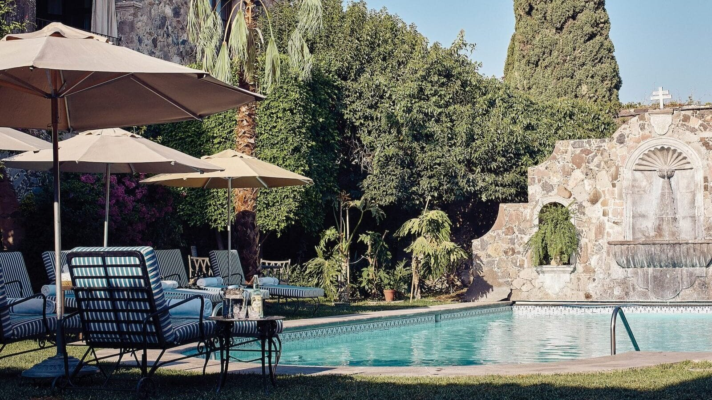

# Drafts of my portfolio

****

## JS fullpage animation test *before license had changed*
```
new fullpage('#fullpage', {

    //options here
    autoScrolling: true,
    navigation: true,
    onLeave: (origin, destination, direction) => {
        const section = destination.item;

        console.log(section);
        TweenMax.fromTo(section, 1, {
            opacity: -1
        }, {
            opacity: 1
        }, '+=700');
        const title = section.querySelector('.title');
        // const illustration = section.querySelector('.illustration');
        const tl = new TimelineMax({
            delay: 0.5
        });
        // const ti = new TimelineMax({
        //     delay: 0.5
        // })

        tl.fromTo(title, 0.5, {
            y: '50',
            opacity: 0
        }, {
            y: 0,
            opacity: 1
        });

        // ti.fromTo(illustration, 0.5 {
        //     y: '100'
        //     opacity: 0
        // }, {
        //         y: 0
        //     opacity: 1
        // }});

    }
});
```

## Section CONTENT S3
```
 <div class="content__flex">
                    <div class="content__flex-space">
                        <div class="content__flex-space-box">
                            <div class="content__flex-space-box-img">
                                
                            </div>
                            <div class="content__flex-space-box-wraper">
                                <h2>Where: Santorini | Distnqt</h2>
                                <p>Hotels description.</p>
                                <button><a target="_blank" href="https://www.distnqt.com/santorini">Read
                                        more</a></button>
                            </div>
                            <!-- flex space box wraper  -->
                        </div>
                        <!-- content flex space box  -->
                    </div>
                    <!-- content flex space  -->
                    <div class="content__flex-space">
                        <div class="content__flex-space-box">
                            <div class="content__flex-space-box-img">
                                
                            </div>
                            <div class="content__flex-space-box-wraper">
                                <h2>Where: London | Distnqt </h2>
                                <p>Hotels description</p>
                                <button><a target="_blank" href="https://www.distnqt.com/london">Read more</a></button>
                            </div>
                            <!-- flex space box wraper  -->
                        </div>
                        <!-- content flex space box  -->
                    </div>
                    <!-- content flex space  -->
                    <div class="content__flex-space">
                        <div class="content__flex-space-box">
                            <div class="content__flex-space-box-img">
                                
                            </div>
                            <div class="content__flex-space-box-wraper">
                                <h2>Where: Milan | Distnqt</h2>
                                <p>Hotels description</p>
                                <button><a target="_blank" href="https://www.distnqt.com/milan">Read more</a></button>
                            </div>
                            <!-- flex space box wraper  -->
                        </div>
                        <!-- content flex space box  -->
                    </div>
                    <!-- content flex space  -->
                    <div class="content__flex-space">
                        <div class="content__flex-space-box">
                            <div class="content__flex-space-box-img">
                                
                            </div>
                            <div class="content__flex-space-box-wraper">
                                <h2>Where: Bali | Distnqt </h2>
                                <p>Hotels description.</p>
                                <button><a target="_blank" href="https://www.distnqt.com/bali">Read more</a></button>
                            </div>
                            <!-- flex space box wraper  -->
                        </div>
                        <!-- content flex space box  -->
                    </div>
                    <!-- content flex -->
                    <!-- container   -->


                    <div class="content__flex-space">
                        <div class="content__flex-space-box">
                            <div class="content__flex-space-box-img">
                                
                            </div>
                            <div class="content__flex-space-box-wraper">
                                <h2>Where: Osaka | Distnqt </h2>
                                <p>Hotels description.</p>
                                <button><a target="_blank" href="https://www.distnqt.com/osaka">Read more</a></button>
                            </div>
                            <!-- flex space box wraper  -->
                        </div>
                        <!-- content flex space box  -->
                    </div>
                    <!-- content flex space  -->
                    <div class="content__flex-space">
                        <div class="content__flex-space-box">
                            <div class="content__flex-space-box-img">
                                
                            </div>
                            <div class="content__flex-space-box-wraper">
                                <h2>Where: Tokyo | Distnqt </h2>
                                <p>Hotels description.</p>
                                <button><a target="_blank" href="https://www.distnqt.com/tokyo">Read more</a></button>
                            </div>
                            <!-- flex space box wraper  -->
                        </div>
                        <!-- content flex space box  -->
                    </div>
                    <!-- content flex space  -->
                    <div class="content__flex-space">
                        <div class="content__flex-space-box">
                            <div class="content__flex-space-box-img">
                                
                            </div>
                            <div class="content__flex-space-box-wraper">
                                <h2>Where: Mexico | Distnqt </h2>
                                <p>Hotels description.</p>
                                <button><a target="_blank" href="https://www.distnqt.com/mexico">Read more</a></button>
                            </div>
                            <!-- flex space box wraper  -->
                        </div>
                        <!-- content flex space box  -->
                    </div>
                    <!-- content flex space  -->
                    <div class="content__flex-space">
                        <div class="content__flex-space-box">
                            <div class="content__flex-space-box-img">
                                
                            </div>
                            <div class="content__flex-space-box-wraper">
                                <h2>Where: Cooknst Blog</h2>
                                <button><a target="_blank" href="https://cooknst.com/hot-news/beats-whisk-dj-leep/">Read
                                    more</a></button>
                                </div>
                                <!-- flex space box wraper  -->
                            </div>
                            <!-- content flex space box  -->
                        </div>
                        <!-- content flex space  -->
```

### Greetings first
```
 <div class="greetings__box">
                        <div class="greetings__box-overlay ">
                            <h1 class="typewriter title">Hello, welcome to my <span
                                    style="color: #b12a24;">Portfolio</span>. </h1>
                            <p class="fadeInAnimation">Please, make yourself comfortable. </p>
                        </div>

                    </div>
                    <!-- greetings  -->
```

### Web dev section

```
   <section id="webdev" class="webdev section s5">
            <div class="container">
                <div class="text-box">
                    <h2 class="title">Web Development: Practice & Personal Projects</h2>
                    <div class="text-box-line"></div>
                </div>
                <!-- textbox   -->
                <div class="webdev__flex">
                    <div class="webdev__flex-space">
                        <div class="webdev__flex-space-box">
                            
                            <div class="webdev__flex-space-box-wraper">
                                <h2>Website name: Salomé & Viola Advogados </h2>
                                <p>Why: Personal project</p>
                                <button><a target="_blank" href="http://salomeviola.com">Website link</a></button>
                            </div>
                            <!-- flex space box wraper  -->
                        </div>
                        <!-- webdev flex space box  -->
                    </div>
                    <!-- webdev flex space  -->
                    <div class="webdev__flex-space">
                        <div class="webdev__flex-space-box">
                            
                            <div class="webdev__flex-space-box-wraper">
                                <h2>Website name: untitled</h2>
                                <p>Why: Study</p>
                                <button><a target="_blank"
                                        href="https://lfelipearaujo.github.io/project03_menuresp/">Website
                                        link</a></button>
                            </div>
                            <!-- flex space box wraper  -->
                        </div>
                        <!-- webdev flex space box  -->
                    </div>
                    <!-- webdev flex space  -->
                    <div class="webdev__flex-space">
                        <div class="webdev__flex-space-box">
                            
                            <div class="webdev__flex-space-box-wraper">
                                <h2>Website name: untitled Dashboard</h2>
                                <p>Why: Study</p>
                                <button><a target="_blank"
                                        href="https://lfelipearaujo.github.io/project11_dashboard/">Website
                                        link</a></button>
                            </div>
                            <!-- flex space box wraper  -->
                        </div>
                        <!-- webdev flex space box  -->
                    </div>
                    <!-- webdev flex space  -->
                </div>
            </div>
            <!-- container  -->
        </section>
        <!-- webdev -->
```

### Grid tests card
still have to finish

```
<div class="webdev__grid">
                    <div class="webdev__grid_card">
                        
                        <div class="card__content">
                            <h2> title</h2>
                            <p>bodybnodybodybodybnody</p>

                        </div>
                        <div class="card__info">
                            <div><a href="#">my lonk</a></div>
                        </div>
                    </div><div class="webdev__grid_card">
                        
                        <div class="card__content">
                            <h2> title</h2>
                            <p>bodybnodybodybodybnody</p>

                        </div>
                        <div class="card__info">
                            <div><a href="#">my lonk</a></div>
                        </div>
                    </div><div class="webdev__grid_card">
                        
                        <div class="card__content">
                            <h2> title</h2>
                            <p>bodybnodybodybodybnody</p>

                        </div>
                        <div class="card__info">
                            <div><a href="#">my lonk</a></div>
                        </div>
                    </div><div class="webdev__grid_card">
                        
                        <div class="card__content">
                            <h2> title</h2>
                            <p>bodybnodybodybodybnody</p>

                        </div>
                        <div class="card__info">
                            <div><a href="#">my lonk</a></div>
                        </div>
                    </div>
                </div>
                ```